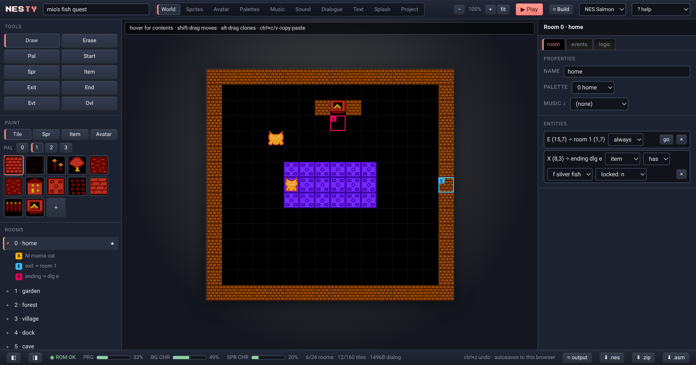
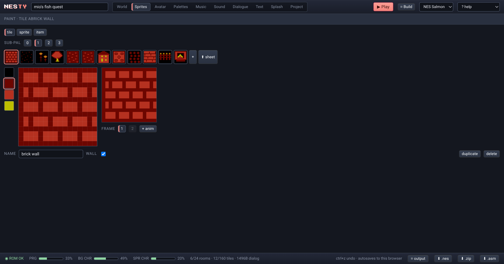
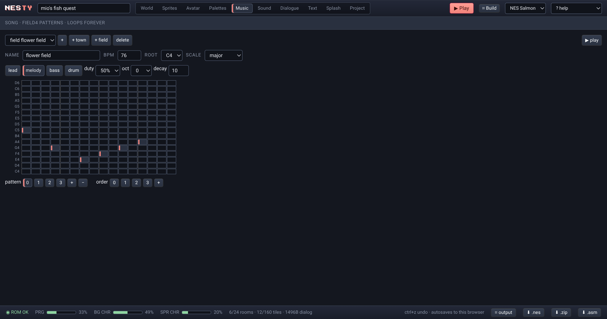
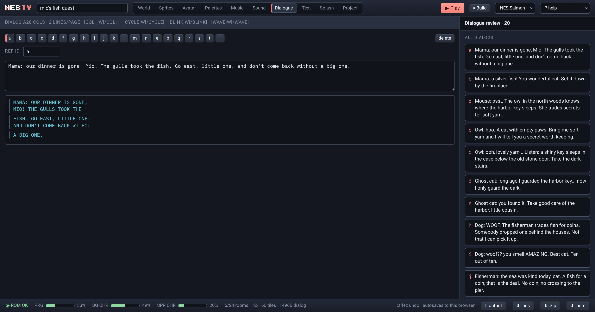

# NESty

**Live:** [nesy.netlify.app](https://nesy.netlify.app/) · **Editor:** [nesy.netlify.app/editor](https://nesy.netlify.app/editor/) · by [delacannon](https://github.com/delacannon)

A [Bitsy](https://make.bitsy.org)-style editor for making **real NES games**. Draw rooms, tiles,
sprites and dialogs in the browser — the app compiles your game to 6502 assembly, assembles it
in-browser into an iNES ROM (NROM, 32KB PRG + 8KB CHR), and lets you play-test it on an embedded
emulator. Download the `.nes` for any emulator or flash cart, and the generated `.asm` to study.

Same spirit as Bitsy: walk around, talk to people, pick up things, be somewhere. No physics —
instant grid movement, one screen per room.

## Screenshots

| World editor                                            | Sprites                                                    |
| ------------------------------------------------------- | ---------------------------------------------------------- |
|  |  |

| Music                                                   | Dialog                                                    |
| ------------------------------------------------------- | --------------------------------------------------------- |
|  |  |

## Quick start

```sh
pnpm install
pnpm dev          # editor at http://localhost:5173
pnpm test         # all unit + headless-emulator tests
```

In the editor: **edit** tab to draw, **play** tab to build + run the ROM (arrows walk, Z talks,
Enter starts), **data** tab to import/export the game as text (`load sample` for a demo game).

## What a game is

- Rooms: 16×15 grid of 16×16px cells — exactly one NES screen (256×240)
- Tiles: 16×16, 3 colors + backdrop, optional wall flag + 2-frame animation
- Avatar / sprites / items: 16×16 metasprites (2×2 hardware sprites), 2-frame animation
- Dialogs: paged text box (28 cols × 2 lines), uppercase 8×8 font
- Exits teleport between rooms; endings show a dialog and stop the game
- Palettes: real NES palettes — backdrop + 4 BG + 4 sprite sub-palettes per set, one BG
  sub-palette per cell (matches NES attribute granularity)

Budgets (enforced live in the status bar): ≤24 rooms, ≤62 tiles, ≤15 sprites+items per room,
≤128 item placements, 32KB PRG, 256+256 CHR tiles with automatic 8×8 deduplication.

## Monorepo

| package             | what                                                                                                           |
| ------------------- | -------------------------------------------------------------------------------------------------------------- |
| `packages/asm6502`  | two-pass 6502 assembler in TS (all 151 official opcodes, `.org/.byte/.word/.res`, expressions)                 |
| `packages/core`     | game data model, text format parse/serialize, validation, NES master palette                                   |
| `packages/compiler` | `engine/engine.asm` (the generic runtime), CHR generation, data table codegen, iNES builder — `buildRom(game)` |
| `apps/editor`       | Vite + React editor with jsnes play-testing                                                                    |

## Game data text format

Bitsy-like, line-oriented (see the **data** tab):

```
GAME my cave adventure
VER 1
START 0 7,7

PAL 0
BKG 0F
BG0 21,11,30
SP0 30,27,16
...

TIL a
NAME rock
WALL true
16 rows of 16 pixels (0-3), '>' separates animation frames

ROOM 0
PAL 0
15 rows of 16 tile ids
PMAP            (optional: per-cell BG sub-palette 0-3)
EXT 15,7 1 0,7  (exit at 15,7 -> room 1 at 0,7)
END e 8,3       (ending: dialog e)
ITM k 3,9       (item placement)

SPR b
DLG c
SPAL 1
POS 0 4,6
pixels...

DLG c
Meow. The cave is deeper than it looks.
```

## Engine (what your ROM does)

NMI-driven 6502 runtime: title screen → walk state (d-pad, wall collision, sprite talk, item
pickup with taken-flags, exits, endings) → paged dialog box with a typewriter effect → ending
lock. Tile animation flips every 32 frames through a vram write buffer that never overruns
vblank. Room loads write the full nametable + attributes + palettes with rendering off.

The downloadable `.asm` is the complete engine plus your game as commented data tables —
assemble it yourself with the bundled assembler or ca65 (with minor directive tweaks).

## Testing

- assembler: hand-typed fixture of all 151 opcodes → exact bytes
- compiler: golden ROM SHA-256 (`UPDATE_GOLDENS=1 pnpm test` after intentional engine changes)
- engine: headless jsnes scenarios — boot, walk, collide, talk, pick up, exit, ending —
  asserting engine RAM via the assembler symbol table

## Notes / limits (v1)

- Uppercase-only ASCII font (saves CHR space for art)
- No audio, no scrolling, no dialog scripting (`VAR` is reserved in the format)
- ≥4 sprites/items on one row will flicker on real hardware (editor warns)
- ROMs are Mesen/FCEUX/everdrive-friendly NROM; jsnes is forgiving
